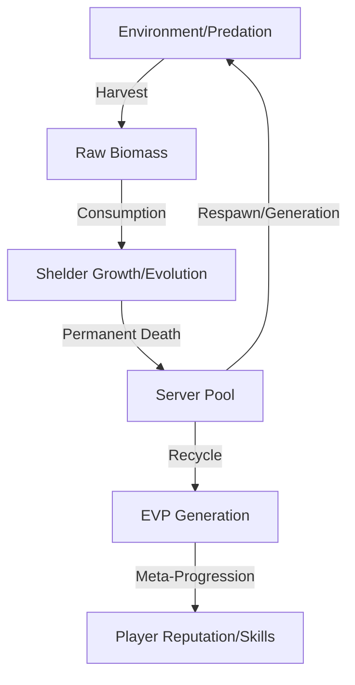

# Concept: Biomass Economy

The **Biomass Economy** is the core circulatory system of the Shelder Evolution world. It governs how energy is captured, transformed, and eventually recycled within the persistent MMORPG ecosystem.

## 1. The Core Loop

The economy operates on a biological conservation model rather than a traditional inflationary currency model.

## 2. Resource Tiers

### Raw Biomass (🍖)

- **Source**: Gained through hunting (PvE/PvP) or gathering specialized nutrients.
- **Usage**: Primary fuel for **Reserve** (long-term energy) and **Stamina** (short-term action).
- **Decay**: Raw biomass decays over time if not processed or consumed, simulating biological rot.

### Evolving Value Protocol (EVP) (✦)

- **Source**: Generated exclusively upon the **Permanent Death** of a Shelder.
- **Significance**: Unlike Biomass, EVP is linked to the player's account (the "Digitized Mind") and persists across character lives.
- **Function**: Used to unlock evolutionary trees, social clout, and access to the "Academy" resources.

## 3. Relationship to Physiological Vitals

The Biomass Economy is directly constrained by the **Fatigue-Stamina-Reserve** system:

- **Stamina**: Immediate tactical capacity. Refreshed by the **Reserve**.
- **Reserve**: The buffer of processed biomass. When empty, the Shelder enters **Fatigue**.
- **Fatigue**: A state of metabolic debt. Prolonged fatigue leads to mutilations and eventual death, feeding the Biomass back into the server.

## 4. Server-Wide Impact

The total available biomass in the server is finite. Large-scale extinctions or over-predation by players can lead to resource scarcity, forcing players to adapt their strategies or face systemic collapse. This ensures the world feels "Living" and "Hard Sci-Fi."
