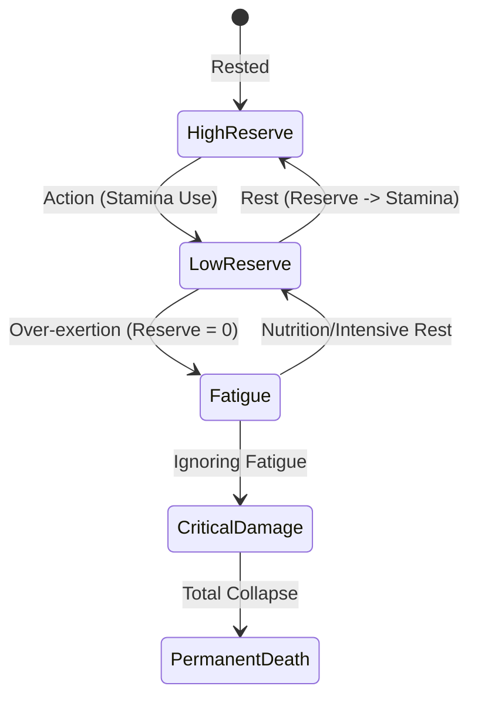

# Concept: Fatigue-Stamina-Reserve (FSR) System

The **FSR System** is the physiological engine of Shelder Evolution. It replaces traditional "Mana" or "Action Points" with a bio-realistic model of energy expenditure and recovery.

## 1. The Three Layers

### Stamina (S)

- **Visual**: The immediate blue bar in the UI.
- **Definition**: Tactical energy available for immediate actions (attacks, dodges, card plays).
- **Recovery**: Regenerates quickly when out of combat, drawing from the **Reserve**.
- **Gameplay Role**: Limits the intensity of a single encounter.

### Reserve (R)

- **Visual**: The orange bar in the UI.
- **Definition**: Long-term metabolic energy (fat, glycogen, nutrients).
- **Function**: The source of Stamina regeneration. Resting (passing turns) converts Reserve into Stamina.
- **Consumption**: Consumed by Stamina regeneration and high-effort world traversal.
- **Gameplay Role**: Limits the duration of a "run" or hunting trip. Requires returning to safety to refuel (consume Biomass).

### Fatigue (F)

- **Visual**: Red pips/indicators in the UI.
- **Definition**: Metabolic debt and systemic damage.
- **Trigger**: Occurs when the **Reserve** is depleted but the player continues to exert effort.
- **Consequences**:
  - Reduced max Stamina.
  - Slower regeneration.
  - **Mutilations**: Tactical debuffs (e.g., "Broken Leg" = slower movement) that are permanent or extremely slow to heal.
- **Gameplay Role**: The "Danger Zone" that leads to Permadeath.

## 2. Interaction Loop

## 3. Design Philosophy

The FSR system is designed to force players into "Biological Logistics." Unlike traditional RPGs where you can fight forever as long as you have potions, Shelder Evolution requires you to respect the biological limits of your creature. Every action has a downstream cost that eventually must be paid.
